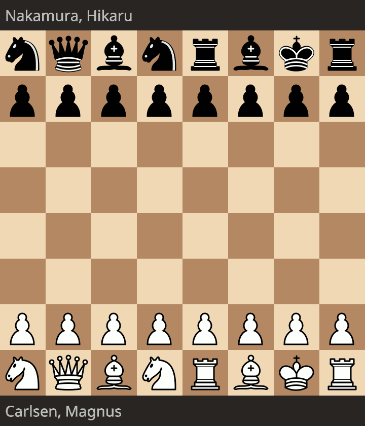

# Lichess Chess960 Arena Scheduler

Source code for the analysis and automated scheduling for the Lichess
Chess960 team 
([https://lichess.org/team/chess960](https://lichess.org/team/chess960)).

Chess960 is a variant which randomizes the pieces on the home rank to reduce
the dependance on opening theory.

The following is a Chess960 game between **Magnus Carlson** (World Champion) and 
**Hikaru Nakamura**, where Nakamura actually wins.

  

